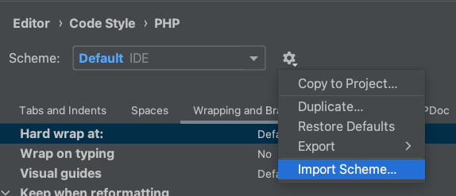
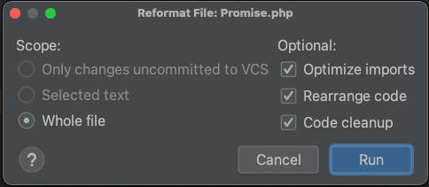

Editor config for  PHPStorm. As the basis used PSR-12 with team-approved re-arrangement options (sorting constants, methods by visibility, and alphabet).

#### Import here:

#### And set-up reformat configuration(cmd+option+shift+L) like this:

For manual current file re-format use shortcut command **cmd+option+L**.